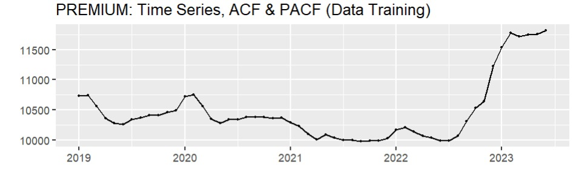
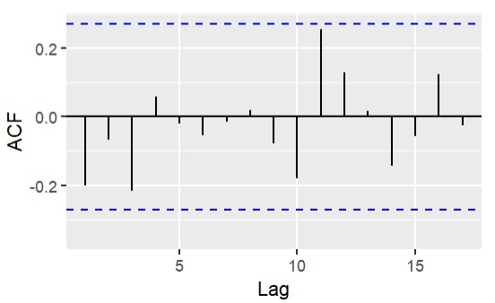
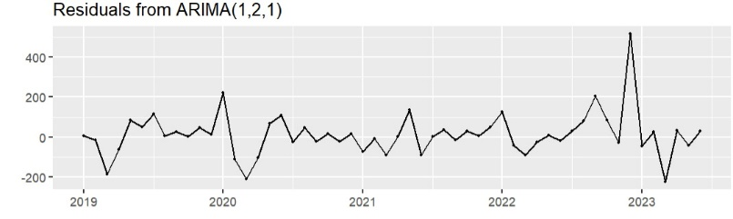
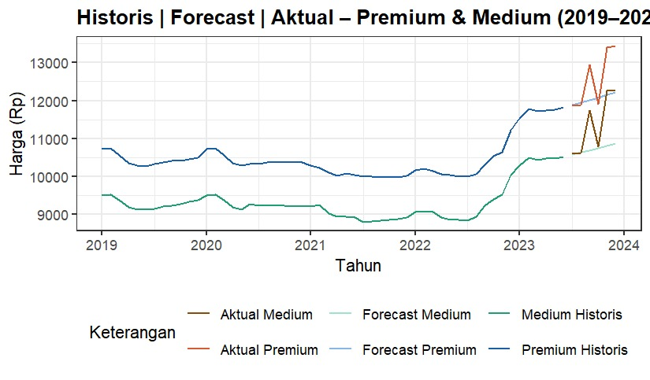

# Rice Price Forecasting Using ARIMA

A time series analysis of premium and medium rice prices in Indonesia, using the Box-Jenkins ARIMA methodology to model historical price behavior and forecast six months ahead. This repository accompanies an academic paper of the same research, presented at an academic symposium (publication in progress).

  

## Table of Contents

- [Background](#background)
- [Problem Statement](#problem-statement)
- [Dataset](#dataset)
- [Tools](#tools)
- [Methodology](#methodology)
- [Results and Discussion](#results-and-discussion)
- [Forecast Accuracy](#forecast-accuracy)
- [Limitations](#limitations)
- [Conclusion and Implications](#conclusion-and-implications)
- [Repository Structure](#repository-structure)
- [How to Reproduce](#how-to-reproduce)
- [Author](#author)
- [License](#license)

## Background

Rice is Indonesia's primary staple food, and fluctuations in its price carry weight well beyond the grocery aisle: they affect household purchasing power, feed directly into inflation figures, and are closely monitored by the government as a matter of market stability. Because of this, forecasting future rice prices has practical value — it gives policymakers and market participants a basis for anticipating supply and price movements rather than reacting to them after the fact.

Most prior work on this topic (e.g., Tarigan et al., 2024; Khairunnisa et al., 2022; Naya et al., 2024) forecasts a single rice price series, or compares candidate models without analyzing premium and medium grades side by side over the same period. This project addresses that gap directly, forecasting both series in parallel using the same methodology and evaluation criteria, which allows their forecasting behavior to be compared rather than assessed in isolation.

## Problem Statement

The analysis is designed to answer two related questions:

1. Can the ARIMA framework produce an adequate statistical fit for both premium and medium rice price series over the study period, as judged by information criteria and residual diagnostics rather than by fit alone?
2. How accurately does the resulting model forecast actual prices over a six-month out-of-sample horizon, and does forecast accuracy hold up equally well for both rice grades?

## Dataset

The data consists of **54 monthly observations** of premium and medium rice prices in Indonesia, spanning **January 2019 to June 2023**, sourced from Badan Pusat Statistik (BPS). The full dataset is available [via Google Drive](https://docs.google.com/spreadsheets/d/18K08KbrzJpH-zDkTPaj22cbqM5BDbid5/edit?usp=drive_link). The series was split chronologically: the first 48 observations were used as training data to fit the model, and the final 6 observations (July–December 2023) were held out as test data to evaluate forecast accuracy against actual outcomes.

Both series move within a fairly narrow band across most of the study period, but show a marked upward shift starting around late 2022 into 2023 — a shift that later proves relevant to how well the model's forecasts hold up against the actual test-period prices (see [Forecast Accuracy](#forecast-accuracy)).



## Tools

All data processing, modeling, and diagnostic testing were conducted in **R** (RStudio), using the `forecast` and `tseries` packages for ARIMA estimation and stationarity testing, and `ggplot2` for visualization.

## Methodology

The analysis follows the standard **Box-Jenkins methodology**: stationarity testing, differencing, order identification, parameter estimation, and residual diagnostics, in that sequence, before any forecast is produced.

### Stationarity and differencing

Both the premium and medium price series were tested for stationarity using the **Augmented Dickey-Fuller (ADF) test**. Both series were found to be non-stationary in their original form. First-order differencing was insufficient to achieve stationarity, so **second-order differencing (d = 2)** was applied to both series before proceeding — a detail worth noting because it directly shapes every candidate model considered afterward: every model in this study takes the form ARIMA(p, 2, q), not ARIMA(p, 1, q).

### Order identification and candidate models

Candidate values of p (autoregressive order) and q (moving average order) were identified from the ACF and PACF plots of the differenced series. Combining these with the fixed d = 2, **16 candidate ARIMA models** were specified for each price series (p, q ∈ {0,1,2,3}) and evaluated using Akaike Information Criterion (AIC) and Bayesian Information Criterion (BIC). The five models with the lowest AIC for each series were carried forward:



| Model | ARIMA(p,2,q) | AIC (Premium) | AIC (Medium) |
|---|---|---|---|
| 4 | (0,2,3) | 645.98 | 641.56 |
| 6 | (1,2,1) | 645.33 | 640.05 |
| 7 | (1,2,2) | 647.30 | 642.04 |
| 10 | (2,2,1) | 647.28 | 642.04 |
| 11 | (2,2,2) | 646.79 | 642.17 |

### Residual diagnostics

Each of the five shortlisted models was tested for residual white noise using the **Ljung-Box test**. All five models, for both series, produced Ljung-Box p-values above the 0.05 significance threshold — meaning none of them showed significant residual autocorrelation, so all five remained statistically eligible going into final model selection.

A Shapiro-Wilk normality test was also run on the residuals, and rejected normality for every candidate model (p < 0.05 across the board). This is not treated as disqualifying: departures from normality are common in commodity price series, and the paper explicitly notes this, relying on the Ljung-Box result as the primary adequacy criterion rather than normality.

### Final model selection

Among the five statistically valid candidates, **Model 6 — ARIMA(1,2,1) — had the lowest AIC for both series**, and was confirmed as the preferred model after a secondary comparison of RMSE, MAE, and MAPE against the other four candidates. The estimated equations for Model 6 are:

Premium rice price series:
```
Y_t = 0.5365 * Y_(t-1) + e_t − 0.9431 * e_(t-1)
```

Medium rice price series:
```
Y_t = 0.5070 * Y_(t-1) + e_t − 0.9446 * e_(t-1)
```

Both series settle on structurally identical model orders with similar coefficient magnitudes, which is itself a notable result — it suggests premium and medium rice prices in Indonesia move according to a similar short-term dependency structure, even though their price levels differ.



## Results and Discussion

The fitted ARIMA(1,2,1) model was used to forecast both price series six months ahead, from July to December 2023, at a 95% confidence interval, and the forecasts were then compared against the actual prices realized over that period.



For most of the six-month horizon, the model tracked actual prices closely. The premium series forecast for July (11,888 vs. an actual 11,866) and August (11,953 vs. 11,896) were both within roughly 60 IDR of the observed value. The medium series showed a similar pattern in the earliest forecast months.

The forecast accuracy deteriorates, however, in the second half of the horizon. From September onward, actual prices for both series rise more sharply than the model anticipated — by December, the premium series' actual price (13,451 IDR) exceeded the point forecast (12,215 IDR) by more than 1,200 IDR, with medium rice showing a comparable gap. This is consistent with the upward price shift visible in the raw data toward the end of the study period: ARIMA models forecast by extrapolating recent linear/autoregressive structure, and are structurally not well-suited to anticipating a level shift that has no analogue in the training window. This is not a flaw specific to the model chosen here — it is a general property of the ARIMA class, and one of the reasons the paper's own discussion of limitations flags weaker performance at longer forecast horizons.

## Forecast Accuracy

Using standard forecast accuracy measures computed via the `forecast` package in R:

| Metric | Premium Rice | Medium Rice |
|---|---|---|
| RMSE | 816.0 | 909.0 |
| MAE | 610.67 | 650.50 |
| MPE | 3.94% | 5.34% |
| **MAPE** | **4.62%** | **5.40%** |

A MAPE below 5% is generally considered a strong result for commodity price forecasting, and both series fall in or near that range — despite the widening gap in the later forecast months described above. This is a useful reminder that a single aggregate accuracy measure, computed across the full forecast horizon, can understate how much accuracy actually degrades toward the end of that horizon; the early months' close fit pulls the aggregate MAPE down even as the later months diverge meaningfully.

## Limitations

- The model captures short-term autoregressive and moving-average structure in the differenced series, but has no mechanism for anticipating a genuine level shift in the underlying price trend — which is exactly what appears to happen in the September–December 2023 test window.
- Residuals for every candidate model fail the Shapiro-Wilk normality test. The analysis treats this as an acceptable property of commodity price data rather than a disqualifying issue, relying on the Ljung-Box test as the adequacy criterion instead — but a reader expecting normally distributed residuals should be aware this assumption does not hold here.
- ARIMA is a univariate method: it forecasts each price series from its own history alone, with no explicit inputs for the structural drivers mentioned in the paper's motivation (weather, distribution infrastructure, import-export policy). Any of those factors could plausibly explain the late-2023 price acceleration that the model missed.
- With 54 monthly observations split 48/6, the test set is small; six months of held-out data limits how confidently the reported MAPE generalizes to other forecast horizons or time periods.

## Conclusion and Implications

ARIMA(1,2,1) provides an adequate statistical fit for both premium and medium rice price series, passing residual white-noise diagnostics and producing a MAPE under 5.5% for both series over a six-month forecast horizon. The near-identical model structure across both rice grades suggests they share a common short-term price dynamic in this dataset, despite differing in absolute price level.

At the same time, the forecast's growing divergence from actual prices in the final months of the test period is itself a meaningful finding: it demonstrates the practical limit of a univariate time series approach when the underlying price trend shifts. For monitoring and policy purposes, this suggests ARIMA forecasts are most reliable as a short-term (1–2 month) tool, and should be supplemented with structural or leading-indicator information when the goal is anticipating turning points rather than extrapolating an existing trend.

## Repository Structure

```
FINAL_ARIMA.R              R script covering data preparation, stationarity testing,
                            model specification, diagnostics, and forecasting
Journal_Rice_Prices.docx    Full academic paper documenting the study
asset/                      R-generated plots referenced throughout this README
LICENSE                     MIT License
```

Raw data (monthly premium and medium rice prices, BPS, 2019–2023) is hosted separately on [Google Drive](https://docs.google.com/spreadsheets/d/18K08KbrzJpH-zDkTPaj22cbqM5BDbid5/edit?usp=drive_link) rather than committed to this repository.

## How to Reproduce

1. Download the monthly premium and medium rice price data from [Google Drive](https://docs.google.com/spreadsheets/d/18K08KbrzJpH-zDkTPaj22cbqM5BDbid5/edit?usp=drive_link) (BPS, Jan 2019–Jun 2023), or substitute an equivalent series.
2. Open `FINAL_ARIMA.R` in RStudio and run it sequentially — it performs the ADF stationarity test, differencing, ACF/PACF-based order identification, and AIC/BIC model comparison in order.
3. Review the Ljung-Box residual diagnostics before accepting a final model; the script is structured so this step must pass before forecasting is run.
4. Generate the six-month forecast and compare against held-out actual values to reproduce the accuracy table above.

## Author

Risma Choerunnisa and Berliana Indah
Study of Actuarial Science, School of Business, President University
[GitHub](https://github.com/rismanshaa) · [Live project page](https://rismanshaa.github.io/Rice-Price-Forecasting/)

## License

This project is licensed under the [MIT License](LICENSE).
